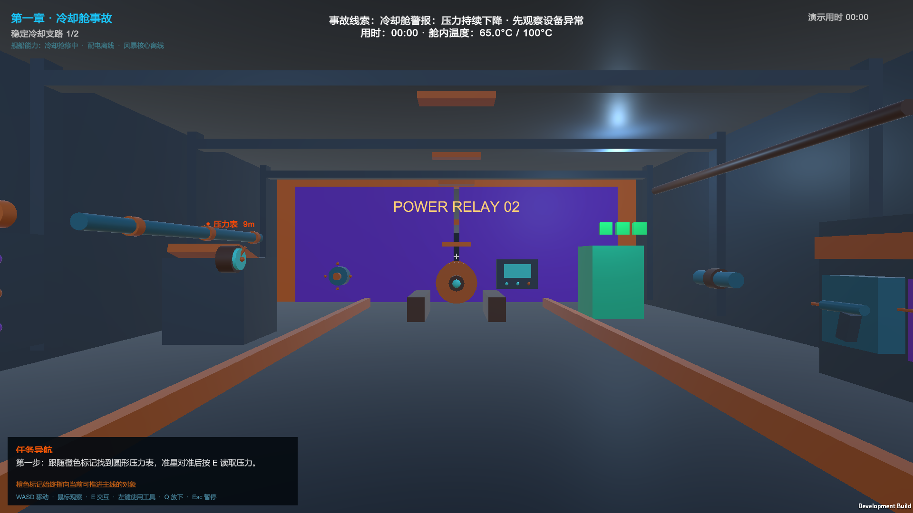
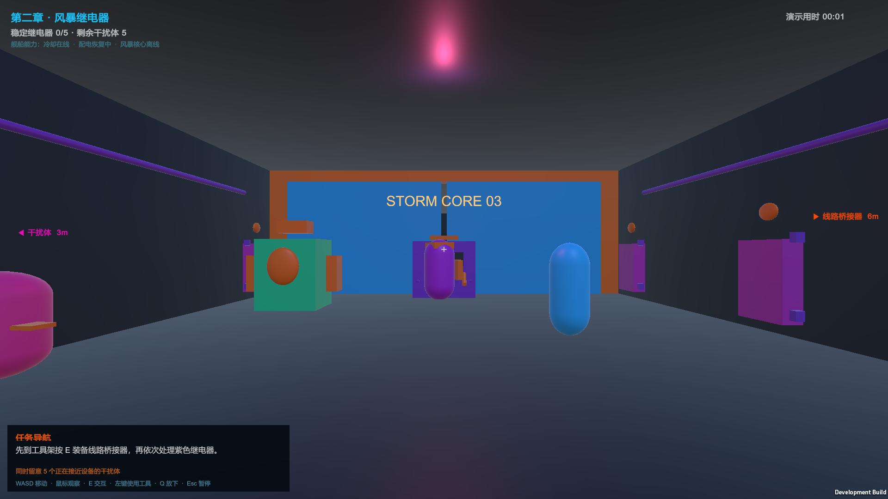
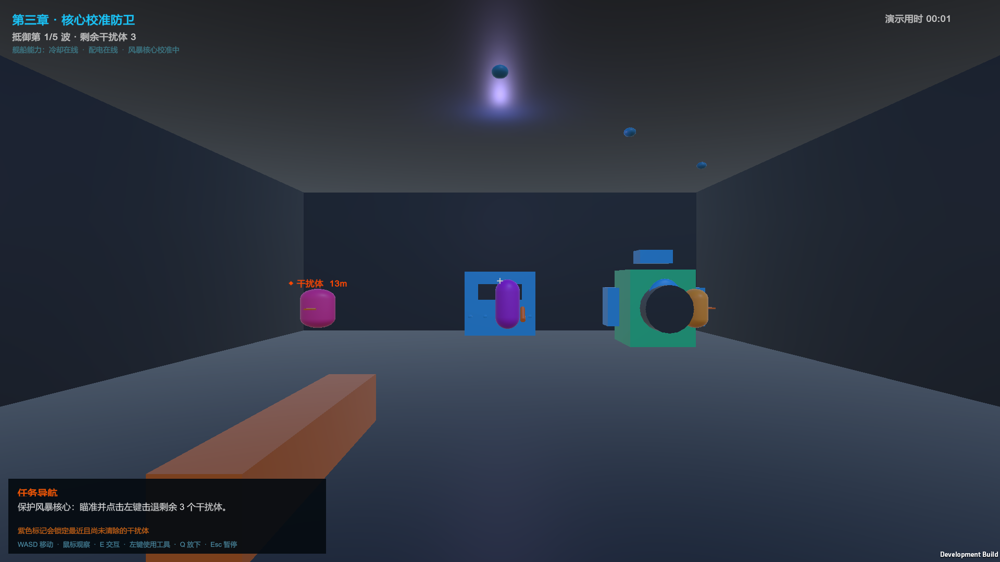
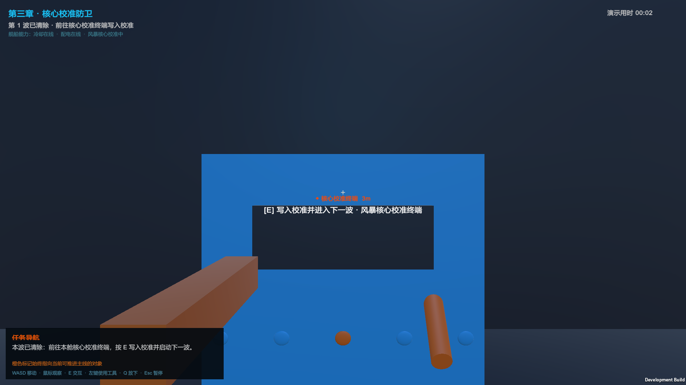
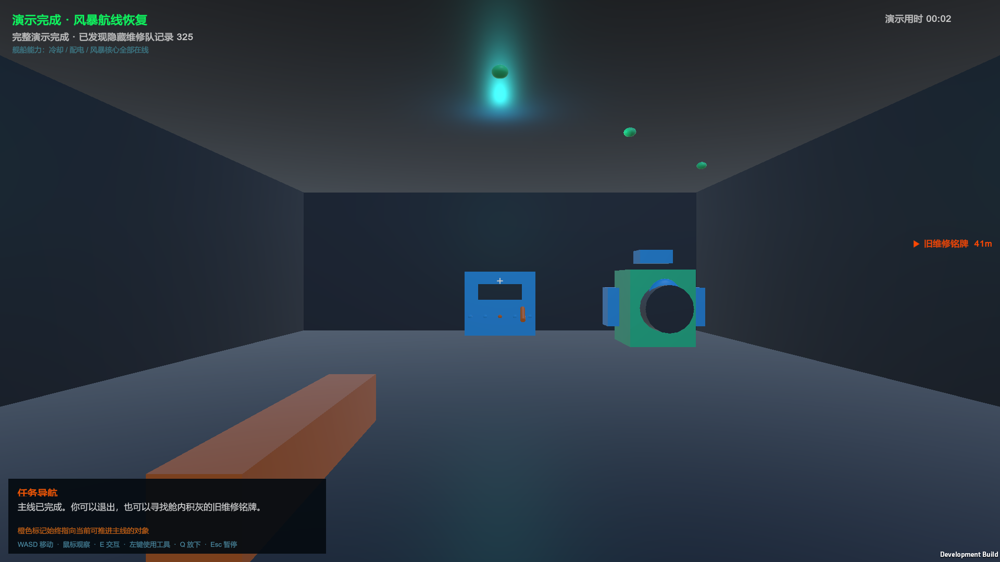

# 单人 Demo 游玩与正式构建贯通记录

## 结论

`feature/singleplayer-extended-incident` 的 Windows Development Build 已在正式生成场景中自动贯通：两轮冷却维修、五座继电器、第二章真实敌群、第三章五波真实敌群、五次校准提交和 325 铭牌均完成，最终状态为三个舰船系统全部在线。

本轮还使用 Computer Use 对同一个 Windows 构建进行了两次真实窗口操作。第一次完成压力表和泵检查后，复现了“目标在身后时标记在左右与底边之间乱窜”，并因寻路耗时在 08:19 温度达到 100°C 后失败；修改导航算法后，第二次再次完成压力表和泵检查，进入线路桥接器阶段，实机确认背后标记稳定在屏幕左右中线。第二次操作约 02:05 时 Computer Use 本地传输中断，因此本记录仍不能证明完整 25–35 分钟体验门禁已经通过。

## 验证范围

贯通验证直接运行 `Builds/SinglePlayerDemo-Windows/FunGame-SinglePlayerDemo.exe`，使用正式场景中的运行时对象，而非合成测试替身：

1. 启动第一章，确认任务导航指向压力表；
2. 按真实规则顺序完成两轮诊断、桥接、密封、拆装和压力复核；
3. 确认配电舱开启，依次完成五座继电器的三步桥接；
4. 使用冲击扳手击败第二章正式敌群；
5. 确认风暴核心舱开启，逐波击败五组正式敌群；五次校准均通过真实准星检测和统一交互入口，在核心舱本地终端提交；
6. 与 325 旧维修铭牌交互；
7. 确认最终章节、2/2 冷却、5/5 继电器、5/5 波次和 `secret325=True` 同时成立。

## Computer Use 真实试玩记录

### 第一次：复现阻塞问题

1. 从主菜单开始游戏，仅根据 HUD 前往压力表；
2. 准星对准设备后出现 `[E] 读取压力异常 · 冷却压力表`，交互成功；
3. 前往泵检查面板，出现 `[E] 检查泵体振动 · 冷却泵检查面板`，交互成功；
4. 下一目标切换为线路桥接器工具架；目标位于身后时，边缘标记会随小幅转向在左、右和底边之间跳动；
5. 寻路受阻后在 08:19 触发温度超限失败，失败原因与重新开始提示可读。

### 第二次：修复后复测

1. 在设置页滚动内容，确认“恢复默认 / 应用并保存 / 返回”操作栏固定在面板底端；
2. 重新开始后再次完成压力表和泵检查，确认这两个正面交互点稳定可用；
3. 进入线路桥接器目标约 01:24 后，多次转动视角，背后目标标记保持在水平左右边缘，不再掉到底边；
4. 约 02:05 时 Computer Use 本地传输中断，未继续验证后续拾取、维修、战斗和结算。

为支持本次开发构建实机复测，Development Build 增加了鼠标备用操作：滚轮按步移动、右键交互、中键丢下。正式的 WASD、`E`、`Q` 输入保持不变，非 Development Build 不启用这些备用绑定。

## 自动贯通关键步骤截图

### 第一章：冷却事故起点



画面检查：章节、冷却支路进度、舰船能力状态、事故线索和“压力表 9m”目标标记同时可见；左下角明确给出目标外观、`E` 键和第一步动作。

### 第二章：配电舱与继电器防卫



画面检查：HUD 已保留“冷却在线”，并显示继电器 0/5、剩余干扰体 5；主任务先指向线路桥接器，紫色次目标同时标出威胁，章节功能与第一章分离。

### 第三章：风暴核心第一波



画面检查：HUD 显示冷却和配电均在线、核心处于校准中；第一波剩余干扰体 3，主目标与扳手操作句一致，风暴核心位于独立后舱。

### 第三章：本舱校准终端



画面检查：第一波清除后，任务在风暴核心舱内直接指向蓝色校准终端；不需要返回配电舱，共用控制台造成的章节功能混淆已消除。

### 最终结算与 325 记录



画面检查：标题变为“演示完成 · 风暴航线恢复”，三个系统全部在线；结算明确记录已发现隐藏维修队记录 325，彩蛋不阻塞主线。

## 自动证据

```powershell
.\Tools\Run-UnityTests.ps1 -Mode All
.\Tools\Build-SinglePlayerDemo.ps1
.\Tools\Test-SinglePlayerDemoCompletion.ps1
.\Tools\Test-SinglePlayerDemoBuild.ps1
```

通过标准：玩家进程退出码为 0；日志包含 `cooling=2/2 relays=5/5 waves=5/5 secret325=True`；五张关键步骤截图全部生成。

正式结算日志还会写入 `cooling`、`relay` 和 `storm` 三段章节耗时。高速贯通验证的数值接近零，只用于校验三段之和与总计时一致；真人试玩应使用 `Run-SinglePlayerDemoPlaytest.ps1` 获取可用于节奏调优的真实章节拆分。

## 本次检查发现

- 三章有清晰的标题、配色、独立空间和累计舰船能力状态，不再把不同功能混在同一舱内；
- 第二章恢复与第三章校准现在使用各自舱内的独立终端；场景断言和正式构建贯通均已覆盖，第三章不再要求返回配电舱操作；
- 第一章的目标句最完整，第二、三章在同时存在主任务与敌人时仍能区分橙色主标记和紫色威胁标记；
- 最终画面能清楚表达通关与 325 彩蛋结果；
- Computer Use 实机操作确认压力表与泵面板正面均能出现提示并完成交互，但尚未覆盖所有左右侧角度；
- 原背后标记会被垂直视角带到底边，造成方向误导；修复后背后目标只贴左右中线，并按目标深度扩大换边死区；
- 设置页底部操作栏在滚动内容时保持固定；
- 自动校准检查点进一步发现：怪物根碰撞关闭后，外伸护甲与侧翼的子碰撞仍会隐形抢占准星；现已在怪物失效时统一关闭整套子碰撞，终端正面可稳定显示 `[E]` 提示；
- 同一生命周期问题也使休眠波次的护甲、侧翼和脉冲冠提前显示为悬浮零件；现已让整套子模型随怪物统一隐藏，第三章与结算截图已确认这些碎片消失；
- 五次核心校准已经覆盖真实准星与交互入口，但冷却、桥接和战斗仍由验证器直接驱动正式对象；步行路线、全场景准星容错、连续密封操作和低模工具可读性仍需完整人工评审。

## 真人试玩待确认

- [ ] 不读文档能否仅凭 HUD 完整通关；
- [ ] 泵面板左、中、右侧和机械法兰正面是否都容易触发交互（正面已通过）；
- [x] 目标在身后时边缘箭头是否稳定（Computer Use 修复后部分流程已通过）；
- [ ] 第二章同时桥接和防卫是否清楚而不过载；
- [ ] 第三章五波是否有组合升级感而非重复堆怪；
- [ ] 所有可见零件是否能理解为环境、工具、设备或怪物组成；
- [ ] 首次完整流程是否落在 25–35 分钟；
- [ ] 发现或错过 325 都不影响正常结算。

## 当前结论

- 自动完整贯通：通过；
- Computer Use 真实操作：完成第一章前两步、失败分支和导航修复复测；
- 完整首次玩家通关：未完成；
- 25–35 分钟时长、后两章操作节奏与美术可读性：仍待同一试玩者完整复测。
